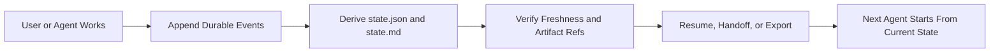
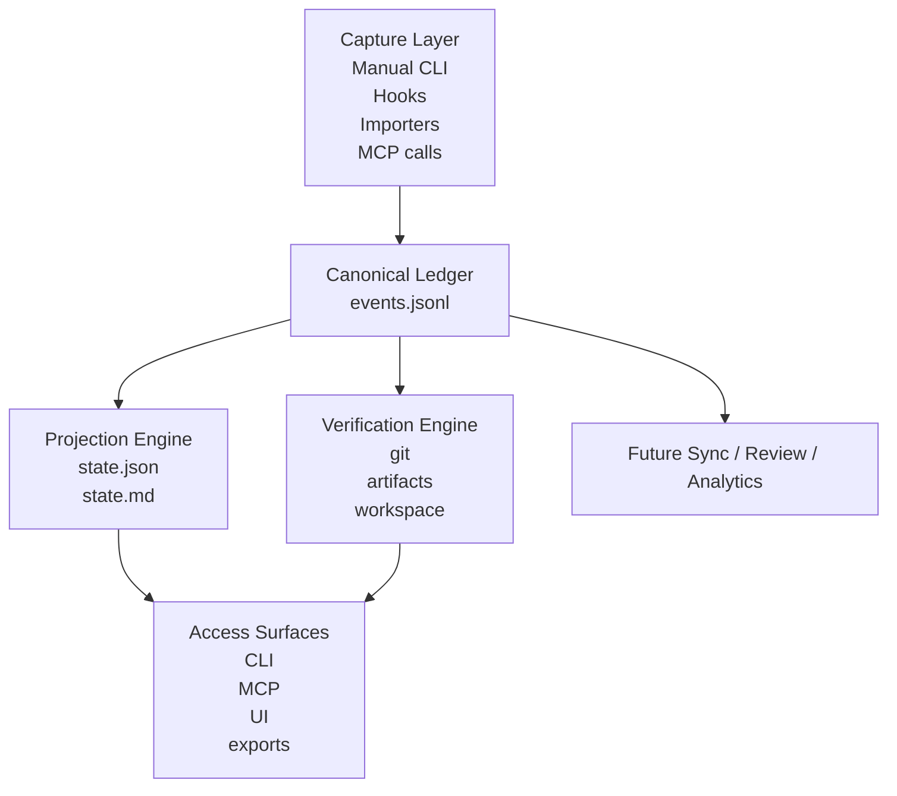
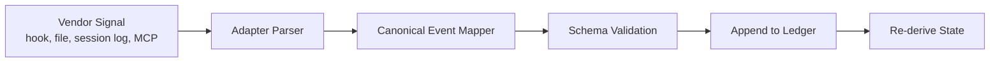

# Detailed Product Architecture

Research-backed architecture and product rationale for Latchet.

Snapshot date: June 19, 2026.

Purpose:

- prove where the product is genuinely novel
- prove why the workflow is usable for real coding-agent users
- define the architecture deeply enough that implementation stays coherent
- separate defensible claims from hype

## 1. Executive Thesis

Latchet should not be presented as a generic AI memory system.

It should be presented as a **repo-local task ledger for AI coding agents** that preserves the durable parts of work:

- accepted or proposed decisions
- failed attempts that should not be retried blindly
- environment quirks and workarounds
- constraints and open questions
- artifact references
- one verified next action

The core novelty is not that it stores context. Many tools already do that in some form.

The defensible novelty is this combination:

1. **Event-sourced task state** instead of transcript-first or wiki-first memory
2. **Failed attempts and env quirks as first-class objects**, not incidental notes
3. **Verification and freshness checks before resume**, so stale state is made visible
4. **A derived single best next action**, so the system ends in an actionable state
5. **Cross-agent portability through repo-local, human-editable files**, not provider-specific hidden memory

That is specific enough to be real and narrow enough to build.

## 2. Why This Product Should Exist

### Market truth

The problem is now real:

- terminal-first coding agents are mainstream enough that people switch among Codex, Claude Code, Cursor, and Gemini-style tools depending on strength, quota, speed, or habit
- these tools increasingly support MCP, hooks, rules, config files, and local project context
- users already create repo-local instruction files because chat transcripts are not a trustworthy operational source of truth

### Structural reason the pain exists

Long-running agent work breaks when durable state lives only inside the active prompt or the prior transcript.

The recurring failures are:

- the next session retries a known-bad approach
- the next tool misses an environment quirk
- the repo changed and the old state is stale
- the current task has no explicit next action
- the user remembers the summary but not the decision trail

This is not solved by a bigger context window alone. Public writing on long-running agents and context engineering increasingly points toward explicit external state layers, not only larger prompts.

### Why users will tolerate this workflow

Users are already doing lighter, worse versions of it:

- `AGENTS.md`
- `CLAUDE.md`
- repo notes
- issue comments
- ad hoc handoff markdown
- saved command outputs

Latchet works if it upgrades an existing habit rather than inventing a brand-new behavior.

That means:

- local-first
- visible files
- low ceremony
- manual-first with optional automation
- useful even before deep integrations exist

## 3. User Need and Usability Thesis

### Primary launch user

The first user is not a team manager.

The first user is a solo technical operator who:

- uses at least two coding-agent tools
- works across multiple sessions or days
- switches branches or repos often enough to lose continuity
- cares about not repeating dead ends more than about preserving every conversation

### Jobs to be done

Latchet should satisfy these jobs better than any alternative:

1. **Resume tomorrow**
   I want to reopen a repo tomorrow and immediately see what mattered, what failed, and what to do next.

2. **Switch tools without relitigating the task**
   I want to move from Claude Code to Codex or Cursor without reconstructing the task from scratch.

3. **Avoid known dead ends**
   I want failed attempts to survive so the next session does not waste time retrying them.

4. **Trust the state before acting on it**
   I want the system to tell me if the repo, branch, commit, or artifact refs are stale or missing.

5. **Share work state safely**
   I want to export a clean handoff or status snapshot without leaking transcript junk or sensitive details.

### Why this is usable

The workflow is usable if the minimum useful path is short:

1. `ledger init`
2. `ledger task create`
3. append a few durable events during work
4. `ledger derive`
5. `ledger show` or export handoff
6. next session starts from `state.md` plus verification

This is dramatically less work than maintaining a rich handoff document by hand, and dramatically more reliable than trusting a transcript.

### Where usability will fail

Latchet will feel bad if:

- users are asked to log too many event types during flow state
- it tries to capture everything and becomes noisy
- exports are pretty but not actionable
- the next action is missing too often
- verification is hidden or too weak

So the product should aggressively optimize for:

- few event types in daily use
- sensible defaults
- strong summaries derived from structured state
- explicit stale-state warnings

## 4. Novelty: Where Latchet Is Actually Different

Novelty should be argued at the product-shape level, not with the claim that nobody else stores context.

### Current landscape by center of gravity

| Category | Primary artifact | What it is good at | What it misses for Latchet's target user |
| --- | --- | --- | --- |
| Transcript movers | transcript, prompt bundle, chat export | handoff between sessions | weak audit trail, weak verification, too much noise |
| Repo continuity runtimes | repo-local state or workflow files | session continuation | often center on workflow loops more than durable event history |
| Memory systems | facts, notes, graph, embeddings, memory store | general recall | can drift broad, magical, or hard to inspect |
| LLM observability tools | traces, spans, logs, evals | system monitoring and debugging | not a user-facing task-state layer for coding work |
| Latchet | append-only task events + derived state | restart, handoff, failure memory, verification, next action | intentionally narrow and not a general memory platform |

### Defensible uniqueness statement

Based on public docs and repos reviewed, the strongest defensible claim is:

> Latchet combines repo-local event-sourced task history, durable failure memory, freshness verification, and a derived next-action view for cross-agent coding workflows.

That is stronger than:

- "first memory for coding agents"
- "best handoff tool"
- "universal context layer"

Those broader claims are not defensible.

### Novelty dimensions that matter

#### 1. Failure is a first-class memory object

Most workflows preserve conclusions better than failed attempts.

Latchet should explicitly preserve:

- what was tried
- why it failed
- suspected cause
- whether it is still unresolved

This is a meaningful distinction because repeated dead ends are one of the highest-friction costs in agent-assisted coding.

#### 2. Verification is part of continuity

Most memory or handoff systems assume the remembered state is still valid.

Latchet should assume the opposite and verify:

- branch
- commit
- workspace existence
- artifact existence
- later: command drift, dependency drift, lockfile drift, tool-version drift

This makes continuity trustworthy instead of only portable.

#### 3. The next action is single-valued

Most notes systems end with a blob of context.

Latchet should end with one best next action. That gives the next session a clean starting point and makes handoff genuinely useful.

#### 4. Human-editable local files remain canonical

This matters because:

- users can inspect and patch state manually
- vendor lock-in stays low
- sync can be optional later
- auditability stays high

#### 5. Handoff is derived, not primary

This is strategically important.

If handoff is primary, the product becomes a formatting tool.

If the ledger is primary, handoff, summaries, UI, exports, and sync are all views on the same state.

### Why provider-native memory does not kill the product

This matters because Codex and other tools are adding their own memory features.

Latchet still has a distinct role because provider-native memory is usually:

- scoped to one vendor or one client
- not designed as a portable repo-local operational artifact
- not centered on failed attempts and verification
- not obviously share-safe
- not the user's explicit append-only audit trail

So the product should not fight provider memory. It should sit above it as:

- cross-vendor task state
- verified continuity
- human-editable audit trail
- exportable handoff and review artifact

## 5. What Latchet Must Not Become

These are the easiest failure modes:

- a generic personal knowledge base
- a transcript warehouse
- a hidden prompt-injection memory layer
- a team project manager clone
- a Langfuse alternative

The product loses sharpness as soon as it tries to solve all of those at once.

## 6. Canonical Workflow

This should remain the base workflow even after richer UI exists.

### Workflow contract

1. create or select a task
2. append durable events manually or through adapters
3. derive current state
4. verify freshness before resuming or handing off
5. continue from the latest accepted state and next action

### Why this workflow is the right one

It aligns with how power users already work:

- repo as source of truth
- text files as inspectable state
- CLI as default surface
- automation where it is deterministic

It also de-risks the product because each step is independently useful.

## 7. Detailed System Architecture

### Layered view

### Package map against the current repo

- `packages/spec`
  Defines the schema and TypeScript types.

- `packages/core`
  Holds append, projection, verification, export/import, git awareness, diffing, and redaction logic.

- `packages/cli`
  Gives the local operational workflow.

- `packages/mcp`
  Exposes current task state and append operations to agent clients.

- `packages/adapters`
  Holds vendor-specific import/export and adapter contracts.

- `apps/site`
  Current marketing surface, not the product UI.

### Architectural rule

The ledger must remain usable without:

- the website
- hosted sync
- vendor integrations
- any local database

Those are optional surfaces, not prerequisites.

## 8. Domain Model

### Core objects

#### Project

Repo-level configuration and selected task pointer.

#### Task

One durable unit of work with:

- id
- title
- goal
- status
- workspace root
- git snapshot

#### Event

Append-only fact about the task with:

- envelope
- actor
- source
- payload
- references
- verification state
- redaction hints
- optional supersession links

#### Projection

Derived state optimized for action:

- active decisions
- recent failures
- env quirks
- open questions
- blockers
- artifact refs
- one next action

#### Evidence

Attached logs, command outputs, tests, or telemetry that support but do not replace decisions.

### Why append-only is correct

Append-only history gives:

- replayability
- audit trail
- safe import behavior
- easier conflict handling later
- a reliable basis for diffing and sync

State changes should happen through new events or explicit supersession, not mutation in place.

### Event families that deserve first-class status

These event types are central to the thesis:

- `decision`
- `failure`
- `env_quirk`
- `next_action`
- `artifact_ref`

These support them:

- `attempt`
- `constraint`
- `open_question`
- `status_change`
- `note`
- `evidence`

## 9. Projection and State Derivation

The projection engine is the most important piece of product logic.

### Design principles

- deterministic replay
- stable ordering
- explicit supersession
- history preserved even when active state changes
- current state optimized for fast reading

### Current derivation rules already aligned with the product thesis

- decisions remain active unless superseded or explicitly rejected
- failures remain visible and are not overwritten by summaries
- env quirks stay active unless superseded
- next action resolves to the latest active event of that type
- artifact refs are deduplicated by path for current state
- blockers are derived from unresolved failures and impactful quirks

### Missing derivation logic worth adding next

- contradiction detection between active decisions
- explicit resolution linkage from later attempts to prior failures
- confidence or verification weighting in projections
- stale next-action detection
- event importance ranking for export compaction

### Why projection matters to usability

Users do not want to read the whole ledger during resume.

They want the shortest trustworthy operational view. That is the job of the projector.

## 10. Verification Architecture

Verification is one of the product's strongest differentiators.

### v1 verification

The current verifier should check:

- workspace availability
- git presence
- expected branch
- expected commit
- artifact existence

### v1.5 verification

Add:

- changed dirty state
- lockfile changes
- missing referenced commands
- missing referenced tools
- changed package manager
- changed test target names

### v2 verification

Add:

- semantic file drift for referenced files
- adapter-reported environment drift
- confidence scoring for imported state
- per-event verification recency

### Why verification is central, not optional

Without verification, continuity becomes confident but stale.

That is worse than missing memory because it encourages incorrect action.

## 11. Adapter Architecture

### Adapter principle

Adapters should translate vendor-specific signals into canonical ledger events.

They should not recreate the entire transcript or hide autonomous behavior inside the integration.

### Adapter pipeline

### Adapter classes

#### 1. Manual prompts and templates

Lowest risk and easiest to ship.

Use for:

- destination-specific handoff text
- compact state prompts
- human review before import

#### 2. File and session importers

Very good early leverage.

Use for:

- saved chat/session summaries
- command output files
- exported logs

#### 3. Deterministic hooks

Highest-value automation if official surfaces exist.

Best first target: Claude Code.

Use for:

- append a failure when a test command fails
- append artifact refs on file generation
- derive at the end of a session
- verify on session start

#### 4. MCP interactions

Best for live read/write access from compliant agent clients.

Use for:

- current task retrieval
- next action retrieval
- appending reviewed events
- exporting handoff packs

### Vendor strategy

#### Codex

First-class, but start with MCP and import/export.

Why:

- official MCP support exists
- project-local config exists
- built-in memories do not eliminate the need for cross-vendor repo-local task state

#### Claude Code

First automation priority.

Why:

- hooks are official and deterministic
- `CLAUDE.md` already conditions users to repo-local operational context

#### Cursor

Important distribution target, but use rule/MCP/hook-first integration before any deeper extension coupling.

#### Gemini / Antigravity

Keep supported, but do not make this the launch dependency because the surrounding product surface is changing.

## 12. UI Architecture

The UI should help users inspect and operate the ledger. It should not invent a second source of truth.

### Product requirement

The UI is justified only if it makes these jobs easier:

- scan current state fast
- inspect the decision trail
- inspect failures and quirks
- edit or supersede the next action
- verify freshness before continuing
- export a clean handoff

### Recommended shape

Phase 2.5 should be a **local inspector UI**, not a broad dashboard.

Recommended components:

- task switcher
- current-state panel
- event timeline
- decision panel
- failure memory panel
- verification panel
- export panel
- diff panel

### Recommended technical architecture

Keep the UI web-first and local-first:

- new app: `apps/inspector`
- local read/write API backed by `@latchet/core`
- launchable with `ledger ui` later
- desktop packaging only after the inspector proves useful

### Why not start with a heavy desktop shell

- it adds packaging complexity before the workflow is validated
- the product risk is not distribution; it is whether the state model is genuinely useful
- a local web inspector is enough to validate usability

### Plugin model for the future

If plugin support is added, it should be narrow and permissioned.

Good plugin extension points:

- custom export renderer
- custom verification check
- custom adapter importer
- custom read-only visualization panel

Bad plugin extension points:

- arbitrary hidden writes to canonical state
- arbitrary mutation of projection rules at runtime

## 13. Sync and Collaboration Architecture

This should remain explicitly later-stage work.

### Principle

Sync should replicate or coordinate the canonical ledger. It should not replace it.

### Safe future shape

- local files remain source of truth
- hosted service stores encrypted synced copies plus metadata
- conflicts are handled at event level, not by mutating state files
- derived state is rebuilt after merges

### Why sync is easier here than in normal note apps

Because events are append-only, sync conflicts can be modeled as:

- duplicate events
- supersession conflicts
- simultaneous next actions

Those are easier to reason about than arbitrary rich-text merges.

### What not to do

- do not introduce a hosted database as the canonical store in the first paid version
- do not design around multi-user editing before solo workflows are sharp

## 14. Evaluation Plan: How to Prove Usability

### Product proof questions

These are the questions the product must answer with evidence:

1. Does Latchet reduce repeated failed attempts?
2. Does Latchet reduce time to resume a paused task?
3. Does cross-agent switching become less lossy?
4. Do users trust verified state more than ad hoc notes?
5. Is the logging burden low enough that people keep using it?

### Core metrics

- median time to resume a paused task
- repeated-failure rate before and after Latchet
- percentage of sessions ending with a valid next action
- percentage of resume attempts that hit a stale-state warning
- cross-tool continuation success rate
- number of manually edited events versus auto-imported events

### Evaluation harness

#### Internal acceptance scenarios

- debug task across two days
- feature task across multiple branches
- switch from Claude Code to Codex mid-task
- crash and restart with only repo plus `.taskledger/`
- export sanitized state for another person or tool

#### Small-user pilot

Run a 2-week pilot with 5 to 10 heavy coding-agent users.

Collect:

- setup friction
- what they actually log
- what they wish was captured automatically
- whether verification prevented mistakes
- whether `state.md` was enough to resume

#### Outcome threshold for "usable"

The product is credibly usable if:

- most pilot users can resume from the state file alone
- most pilot users report at least one avoided repeated dead end
- the average manual logging burden stays low
- verification catches stale state often enough to justify itself

## 15. Delivery Plan and Phase Gates

### Phase A: Core hardening

Goal:

- make the ledger model undeniably correct and replay-safe

Ship:

- deterministic projector
- stronger fixtures
- corrupt-file recovery behavior
- dedupe rules
- contradiction detection

Exit gate:

- multiple fixture classes replay cleanly and produce stable output

### Phase B: Real-world proof

Goal:

- prove the workflow on actual repos and tasks

Ship:

- one debug demo
- one cross-agent demo
- one crash/restart demo

Exit gate:

- the product story is visually obvious in under 60 seconds

### Phase C: First automation

Goal:

- reduce logging burden without creating magic

Ship:

- Claude Code hook flow
- stronger Codex/Cursor importers
- artifact and test evidence capture

Exit gate:

- useful events appear during real usage with low noise

### Phase D: Inspector UI

Goal:

- make the ledger easier to inspect and operate

Ship:

- local inspector app
- timeline, failures, verification, export

Exit gate:

- UI improves comprehension and export speed without changing the core data model

### Phase E: Paid sync and review

Goal:

- monetize convenience and collaboration

Ship:

- optional sync
- reviewer approvals
- audit exports
- policy controls

Exit gate:

- users already retain on the free local-first workflow

## 16. Main Risks and Countermoves

### Risk: "This already exists"

Counter:

- do not claim to have invented continuity
- claim the event-ledger + failure-memory + verification + next-action combination

### Risk: manual logging feels like overhead

Counter:

- keep manual-first but add selective automation
- bias toward only five daily-use event types

### Risk: built-in vendor memory makes Latchet feel redundant

Counter:

- position Latchet as cross-vendor, repo-local, inspectable, and verified
- built-in memory can complement it, not replace it

### Risk: the product turns into vague "memory"

Counter:

- keep all roadmap decisions tied to the core job of avoiding repeated mistakes and restart waste

### Risk: UI distracts from the hard product problem

Counter:

- ship inspector UI only after the core workflow is proven on real tasks

## 17. Claims You Can Publicly Make

Safe claims:

- repo-local task ledger for AI coding agents
- keeps decisions, failed attempts, env quirks, and next action in one place
- handoff is derived from structured task state
- works across sessions and tools
- designed to reduce repeated dead ends
- inspectable, human-editable, local-first core

Claims to avoid:

- universal memory for every AI workflow
- perfect transcript portability
- autonomous capture of everything that matters
- complete replacement for provider-native memory systems
- "first" or "only" unless narrowed heavily and re-verified

## 18. Decision Summary

If the product remains narrow, Latchet is worth building.

The strongest version of the product is:

- local-first
- event-sourced
- verification-heavy
- failure-aware
- next-action-oriented
- cross-agent by design

The weakest version is:

- broad memory
- transcript-centric
- noisy automation
- hidden state
- unclear next step

Everything on the roadmap should be judged against that difference.

## 19. Sources

Technical and ecosystem:

- Model Context Protocol overview: <https://modelcontextprotocol.io/docs/getting-started/intro>
- MCP specification: <https://modelcontextprotocol.io/specification/2025-11-25>
- Codex CLI: <https://developers.openai.com/codex/cli>
- Codex MCP: <https://developers.openai.com/codex/mcp>
- Codex config basics: <https://developers.openai.com/codex/config-basic>
- Codex memories: <https://developers.openai.com/codex/memories>
- Claude Code overview: <https://code.claude.com/docs/en/overview>
- Claude Code hooks: <https://code.claude.com/docs/en/hooks>
- Claude Code hooks guide: <https://code.claude.com/docs/en/hooks-guide>
- Cursor docs: <https://cursor.com/docs>
- Cursor MCP: <https://cursor.com/docs/mcp>
- Cursor Rules: <https://cursor.com/docs/rules>
- Cursor Hooks: <https://cursor.com/docs/hooks>
- Cursor Agent Skills: <https://cursor.com/docs/skills>
- Gemini CLI docs: <https://geminicli.com/docs/>
- Gemini CLI MCP: <https://geminicli.com/docs/tools/mcp-server/>
- Gemini CLI extensions: <https://geminicli.com/docs/extensions/>
- Gemini CLI quotas and pricing: <https://geminicli.com/docs/resources/quota-and-pricing/>
- Tauri overview: <https://v2.tauri.app/>
- Tauri plugin development: <https://v2.tauri.app/develop/plugins/>
- JSON Schema 2020-12: <https://json-schema.org/specification>
- Ajv getting started: <https://ajv.js.org/guide/getting-started.html>
- OpenTelemetry JS / Node.js: <https://opentelemetry.io/docs/languages/js/getting-started/nodejs/>

Long-running agent and context references:

- Addy Osmani on long-running agents: <https://addyosmani.com/blog/long-running-agents/>
- Anthropic on context engineering: <https://www.anthropic.com/engineering/context-engineering-for-agents>
- OpenAI on prompting/harnesses for agents: <https://developers.openai.com/codex/prompting/harnesses/>

Competition and adjacent tools:

- AICTX site: <https://aictx.org/>
- AICTX GitHub: <https://github.com/oldskultxo/aictx>
- ai-memory GitHub: <https://github.com/akitaonrails/ai-memory>
- agentmemory GitHub: <https://github.com/rohitg00/agentmemory>
- handoff article: <https://semiherdogan.medium.com/handoff-a-better-way-to-run-autonomous-development-loops-00e97e62d470>
- basic-memory GitHub: <https://github.com/basicmachines-co/basic-memory>
- basic-memory technical docs: <https://docs.basicmemory.com/reference/technical-information>

User need and workflow discussions:

- Cursor forum continuity discussion: <https://forum.cursor.com/t/how-are-people-handling-context-across-different-ai-coding-tools/159891>

Pricing references:

- Cursor pricing: <https://cursor.com/pricing>
- Raycast pricing: <https://www.raycast.com/pricing>
- Linear pricing: <https://linear.app/pricing>
- Langfuse pricing: <https://langfuse.com/pricing>
- ChatGPT pricing: <https://chatgpt.com/pricing/>
- Codex pricing: <https://developers.openai.com/codex/pricing>
- ChatGPT Business: <https://help.openai.com/en/articles/8792828-what-is-chatgpt-business>
- Claude pricing: <https://claude.com/pricing>
- Claude Team pricing: <https://support.claude.com/en/articles/9266767-what-is-the-team-plan>
